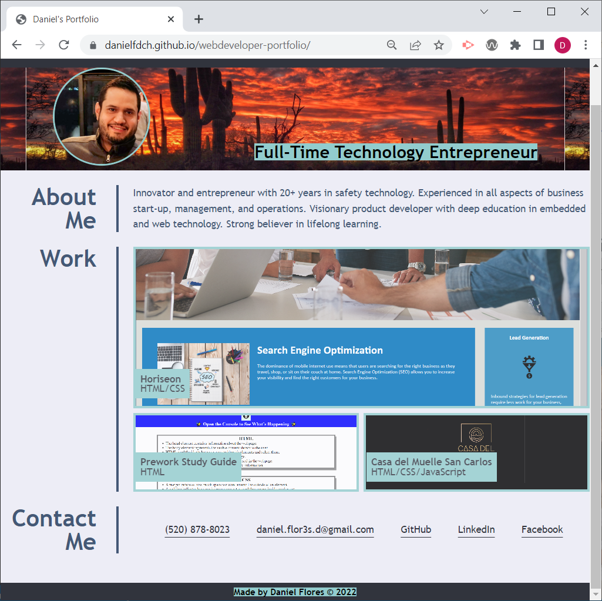

# Web Developer Portfolio Website Project

## Description

This project aims to implement a website that showcases a web developer's portfolio of deployed applications for potential employers to review. The portfolio includes the following features:

* Contact information
* Deployed applications links
* Responsive layout

The website was implemented using HTML and CSS, and it follows accessibility standards.

## Installation
Source code can be downloaded at https://github.com/danielfloresd/webdeveloper-portfolio/archive/refs/heads/main.zip.
Git repository located at git@github.com:danielfloresd/webdeveloper-portfolio.git 

## Usage
To view the website, please visit https://danielfloresd.github.io/webdeveloper-portfolio/

## Credits

Reset CSS file provided by the UofA coding bootcamp

<!-- User Story
AS AN employer
I WANT to view a potential employee's deployed portfolio of work samples
SO THAT I can review samples of their work and assess whether they're a good candidate for an open position

Acceptance Criteria
Here are the critical requirements necessary to develop a portfolio that satisfies a typical hiring manager's needs:

GIVEN I need to sample a potential employee's previous work
WHEN I load their portfolio
THEN I am presented with the developer's name, a recent photo or avatar, and links to sections about them, their work, and how to contact them
WHEN I click one of the links in the navigation
THEN the UI scrolls to the corresponding section
WHEN I click on the link to the section about their work
THEN the UI scrolls to a section with titled images of the developer's applications
WHEN I am presented with the developer's first application
THEN that application's image should be larger in size than the others
WHEN I click on the images of the applications
THEN I am taken to that deployed application
WHEN I resize the page or view the site on various screens and devices
THEN I am presented with a responsive layout that adapts to my viewport -->
